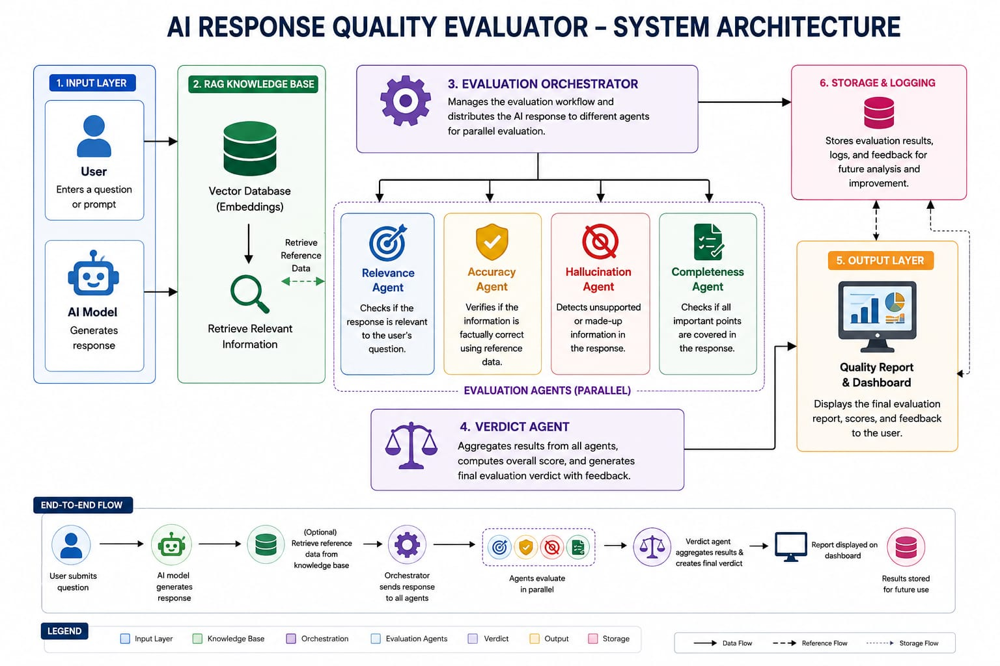

# AI Response Quality Evaluator

## 1. Project Overview

The AI Response Quality Evaluator is a multi-agent system designed to measure the quality and reliability of AI-generated responses. The main objective of this project is to automatically evaluate whether an AI answer is relevant to the user's query, factually correct, complete, and free from hallucinated information.

The system follows an agent-based approach where each evaluation agent focuses on a specific quality parameter. To improve the accuracy of the evaluation, the system refers to a Retrieval-Augmented Generation (RAG) knowledge base that provides trusted reference information whenever required. The outputs of all evaluation agents are collected and processed by an orchestration module, which generates a final quality report containing individual scores, an overall assessment, and useful feedback. This report is then presented to the user through a dashboard for easy analysis.

The project aims to provide a structured and scalable framework for evaluating AI responses, making it useful for applications where the reliability and quality of AI-generated content are important.

## 2. High-Level System Architecture

The AI Response Quality Evaluator follows a modular architecture, where the complete evaluation process is divided into smaller components, each handling a specific responsibility. This design makes the system easier to understand, maintain, and enhance as new evaluation features are added in future milestones.

The evaluation starts when a user submits a question along with an AI-generated response through the Evaluation Input Module. Once the input is received, the Evaluation Orchestrator manages the complete workflow by sending the response to different evaluation agents instead of processing everything in a single step.

Each evaluation agent focuses on one quality aspect. The Relevance Agent checks whether the response actually answers the user's question. The Accuracy Agent verifies the factual correctness of the response, while the Hallucination Agent looks for unsupported or fabricated information. The Completeness Agent ensures that no important information related to the user's query has been left out.

Whenever additional verification is required, the system retrieves trusted reference information from the RAG-based knowledge base. After all the evaluation agents finish their analysis, their observations are collected by the Verdict Agent, which prepares the final evaluation report. The report is then displayed on the dashboard in a structured format, allowing users to understand the overall quality of the AI-generated response.

## 3. Design Objectives

The purpose of this project is to create a system that can check the quality of AI-generated responses in a structured way. Instead of giving a single overall judgement, the system evaluates different aspects such as relevance, accuracy, completeness, and hallucination separately, making the final result more meaningful.

Another important goal is to keep the design simple and modular. Since each agent has its own responsibility, the system can be maintained easily and new features can be added in the future without affecting the existing workflow. The use of a RAG knowledge base also helps the system compare AI responses with trusted information whenever verification is required.

## 4. System Workflow

The system follows a simple workflow to evaluate the quality of AI-generated responses. It starts when the user enters a question along with the AI response that needs to be checked. The system first collects this information and prepares it for evaluation.

If the response contains factual information, the system can retrieve relevant reference data from the RAG knowledge base for verification. After that, the response is passed to different evaluation agents. Instead of checking everything together, each agent focuses on one specific task, such as relevance, accuracy, hallucination detection, or completeness.

Once all the agents complete their evaluation, their results are combined by the Verdict Agent to generate the final evaluation report. The report is then displayed on the dashboard, making it easier for the user to understand the quality of the AI-generated response.

## 5. Agent Responsibilities

Since one person cannot do every job equally well, this project also divides the evaluation into different parts. Each agent is given a separate responsibility, so instead of checking everything together, every agent focuses on only one aspect of the AI response. This makes the evaluation process more systematic and also makes it easier to identify where the response is actually good or where it needs improvement.
     | Agent | Responsibility |
|--------|----------------|
| Relevance Agent | This agent checks whether the AI has actually answered the user's question. Sometimes an AI gives a long answer, but it doesn't really answer what was asked. The Relevance Agent makes sure the response stays on the topic. |
| Accuracy Agent | This agent checks whether the information given by the AI is correct. If there are facts, dates, names or other important details, it compares them with the reference available in the knowledge base to make sure the answer is reliable. || Hallucination Agent | Sometimes AI gives information that sounds correct but is actually wrong or has no proof. The Hallucination Agent checks for such information and verifies it with the reference data. If the information is not supported, it is marked as a hallucination. |
| Completeness Agent | This agent checks whether the AI has answered the question completely. Even if the answer is correct, it may miss some important points. The Completeness Agent helps find those missing parts. |
| Verdict Agent | This is the final agent in the system. It collects the results from all the other agents and prepares the final evaluation report. The report gives an overall idea of how good and reliable the AI response is. |

## 6. Agent Orchestration Flow

In this project, all the agents work together to evaluate the AI-generated response. The process starts when the user enters a question along with the AI response. After receiving the input, the Evaluation Orchestrator manages the complete workflow and sends the response to different evaluation agents.

Each agent has its own role in the evaluation. The Relevance Agent checks if the response answers the user's question, the Accuracy Agent verifies whether the information is correct, the Hallucination Agent checks for any unsupported or incorrect claims, and the Completeness Agent makes sure that no important point has been missed.

If the system needs to verify any information, it retrieves the required reference from the RAG knowledge base. After all the agents finish their work, their results are collected by the Verdict Agent. The Verdict Agent combines all the findings and prepares the final evaluation report, which is then displayed on the dashboard. In this way, all the agents work together to provide a complete and reliable evaluation of the AI-generated response.

   ### Agent Orchestration Flow Diagram

User
   │
   ▼
Input Module
   │
   ▼
Evaluation Orchestrator
   │
   ├── Relevance Agent
   ├── Accuracy Agent
   ├── Hallucination Agent
   ├── Completeness Agent
   │
   ▼
Verdict Agent
   │
   ▼
Dashboard

## 7. System Architecture

The system is designed in a way that every part has its own job. When the user gives a question and an AI-generated response, the evaluation process starts. If the system needs to check whether any information is correct, it first gets the required reference from the RAG knowledge base.

After that, the Evaluation Orchestrator takes over and sends the response to different evaluation agents. Instead of checking everything together, each agent checks only one thing. The Relevance Agent checks whether the response actually answers the question. The Accuracy Agent checks if the information is correct. The Hallucination Agent looks for any information that is not supported by the reference, and the Completeness Agent checks whether any important point has been left out.

When all the agents finish their work, the Verdict Agent collects their results and prepares the final evaluation report. This report is then shown on the dashboard so that the user can easily understand how good and reliable the AI response is.

I chose this modular design because it keeps the system simple and organized. It also makes it easier to improve the project later by adding more evaluation agents without changing the whole system.!

### System Architecture Diagram
